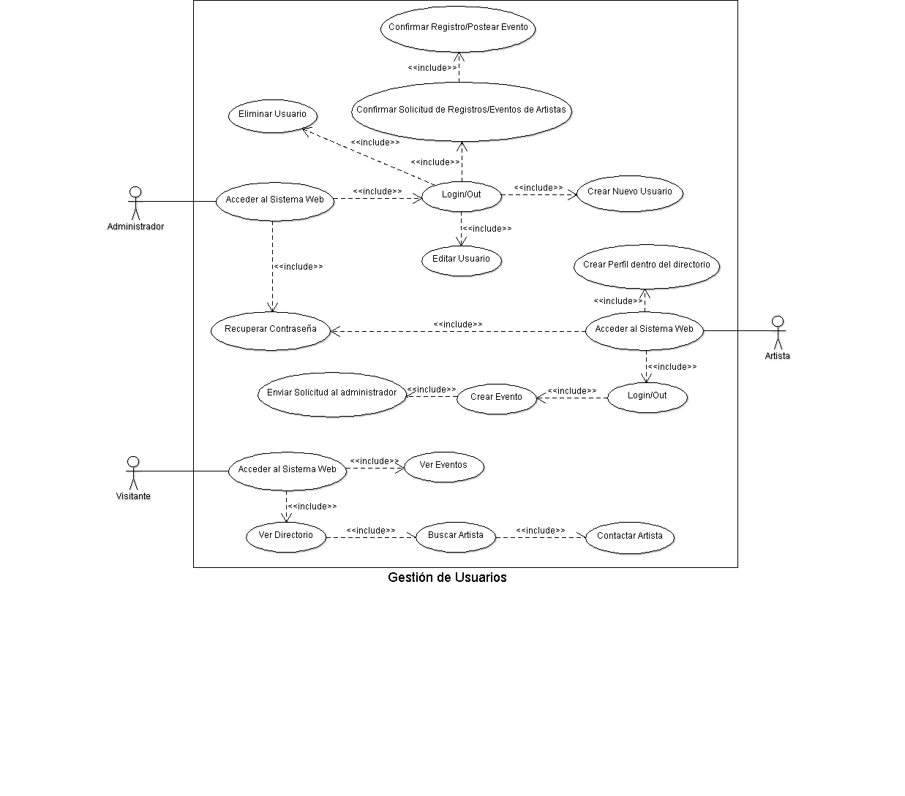
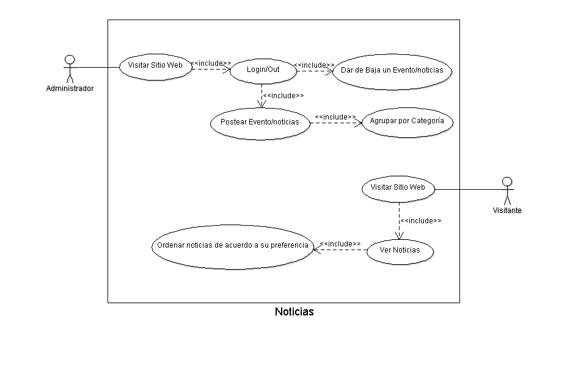

Diseño de la aplicacíon
=======================

Casos de Uso
------------
.. image:: ../images/caso1.png

.. image:: ../images/directorio.png

Clases
------

Diagramas de clases y de sus distintas actividades, si fuese necesario.

Diagrama de BD
--------------

Diagrama de la Base de Datos que requerirá el software.
