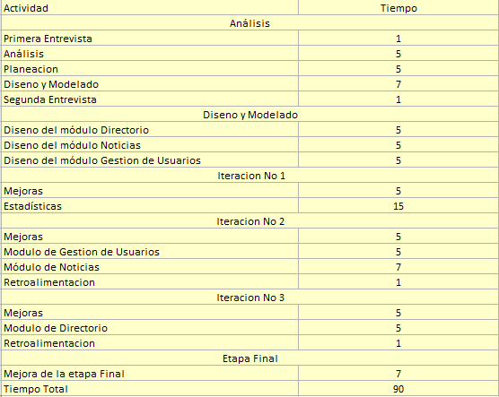

Desarrollo del proyecto
=======================

Cómo se trabajará
-----------------

El proyecto será desarrollado utilizando el modelo de Desarrollo iterativo Creciente.
La idea principal detrás de este modelo es desarrollar un sistema de programas de 
manera imcremental, permitiéndonos sacar ventaja de lo que se ha aprendido a lo largo
del desarrollo actual, incrementando, versiones entregables de este sistema.

Actividades a realizar
----------------------

1) Entrevista
Esta consiste en tomar los requisitos tecnicos, objetivos, mision del proyecto. De ser
necesario se realizará mas de una entrevista.

Siguiendo el modelo iterativo, la primera actividad a realizarse es:
2) Etapa de inicialización
En esta etapa se crea una version del sistema. La meta de esta etapa es crear un sistema con el que
el usuario pueda interactuar.

3) Etapa de iteración 
En esta etapa se realiza el rediseno, para alcanzar metas de confiabilidad, eficiencia y eficacia.

Entregables
-----------

1) Manual de Administrador
Se detalla todas las acciones que puede realizar el administrador.
2) Manual de Usuario Artista
Se detalla el papel del usuario comun, como interactuará con el sistema.
3) Dirección del sistema web.
Acceso al sistema web.

Tabla de tiempos y costos
-------------------------

Condiciones
-----------

1) Ya que este es un sistema web, el costo del host lo pagará el cliente.

